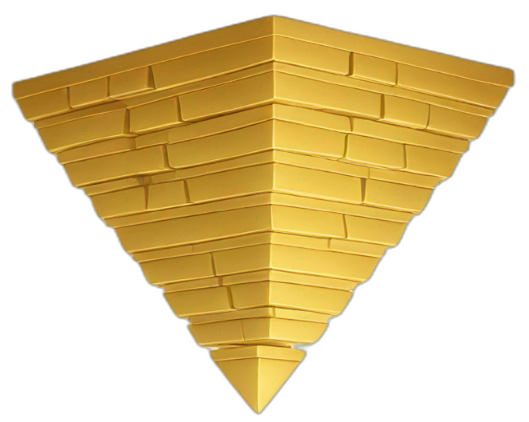
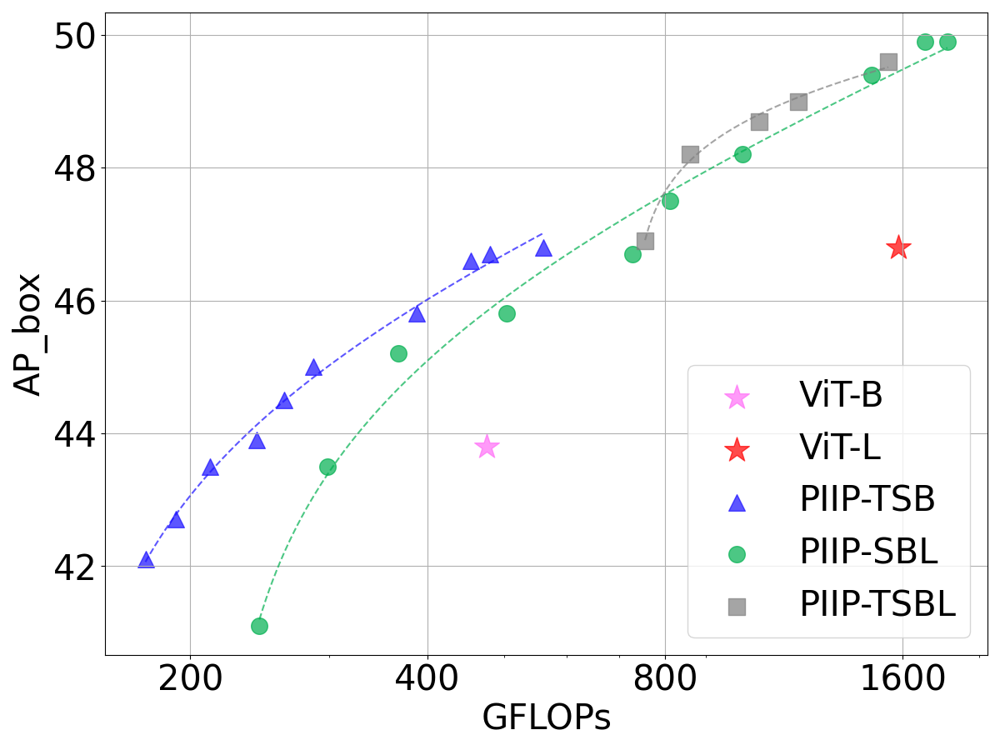
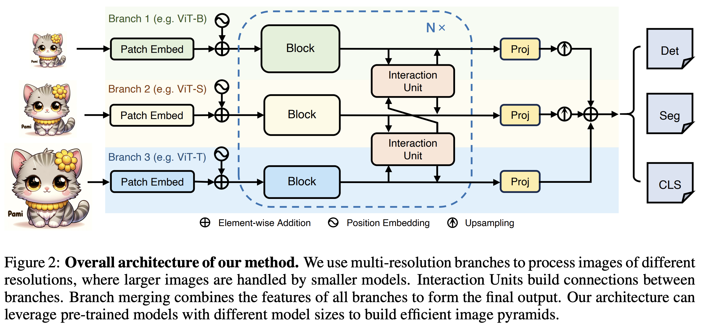

#  Parameter-Inverted Image Pyramid Networks (PIIP)

The official implementation of the paper "[Parameter-Inverted Image Pyramid Networks](https://arxiv.org/abs/2406.04330)".

## ⭐️ Highlights

**TL;DR:** We introduce the Parameter-Inverted Image Pyramid Networks (PIIP), employing a parameter-inverted paradigm that uses models with different parameter sizes to process different resolution levels of the image pyramid, thereby saving computation cost while improving the performance.

* Support tasks of `object detection`, `instance segmentation`, `semantic segmentation` and `image classification`.
* Surpasses single-branch methods with `higher performance` and `lower computation cost`.
* Improve the performance of `InternViT-6B` on object detection by 2.0% (55.8\% $\rm AP^b$) while reducing computation cost by 62\%.

<p align="center">
 
</p>

## 📌 Abstract

Image pyramids are commonly used in modern computer vision tasks to obtain multi-scale features for precise understanding of images. However, image pyramids process multiple resolutions of images using the same large-scale model, which requires significant computational cost. To overcome this issue, we propose a novel network architecture known as the Parameter-Inverted Image Pyramid Networks (PIIP). Our core idea is to use models with different parameter sizes to process different resolution levels of the image pyramid, thereby balancing computational efficiency and performance. Specifically, the input to PIIP is a set of multi-scale images, where higher resolution images are processed by smaller networks. We further propose a feature interaction mechanism to allow features of different resolutions to complement each other and effectively integrate information from different spatial scales. Extensive experiments demonstrate that the PIIP achieves superior performance in tasks such as object detection, segmentation, and image classification, compared to traditional image pyramid methods and single-branch networks, while reducing computational cost. Notably, when applying our method on a large-scale vision foundation model InternViT-6B, we improve its performance by 1%-2% on detection and segmentation with only 40%-60% of the original computation. These results validate the effectiveness of the PIIP approach and provide a new technical direction for future vision computing tasks.

## 🔍 Method



## 🛠️ Usage

For instructions on installation, pretrained models, training and evaluation, please refer to the readme files under each subfolder:

- [mmdetection](mmdetection/README.md)
- [mmsegmentation](mmsegmentation/README.md)
- [classification](classification/README.md)

## 🚀 Released Models

### COCO Object Detection and Instance Segmentation

**Note**: 
1. We report the number of parameters and FLOPs of the backbone.
2. Results in the paper were obtained with an internal codebase, which may exhibit slightly different performance than this repo ($\leq\pm0.2$).
3. Experiments involving InternViT-6B do not use window attention, different from those in the paper.

|   Backbone   |  Detector  |     Resolution     | Schd |   Box mAP   |  Mask mAP  |  #Param  |    #FLOPs    |                                                                                                              Download                                                                                                              |
| :----------: | :--------: | :----------------: | :--: | :---------: | :---------: | :------: | :-----------: | :---------------------------------------------------------------------------------------------------------------------------------------------------------------------------------------------------------------------------------: |
|    ViT-B    | Mask R-CNN |        1024        |  1x  |    43.7    |    39.7    |  90M  |     463G     |                                                              [log](https://huggingface.co/OpenGVLab/PIIP/raw/main/detection/mask_rcnn_deit_vit_b_fpn_1x_coco_bs16.log.json) \| [ckpt](https://huggingface.co/OpenGVLab/PIIP/resolve/main/detection/mask_rcnn_deit_vit_b_fpn_1x_coco_bs16.pth?download=true) \| [cfg](mmdetection/configs/piip/baseline/mask_rcnn_deit_vit_b_fpn_1x_coco_bs16.py)                                                              |
|   PIIP-TSB   | Mask R-CNN |    1120/896/448    |  1x  | 43.6 |    38.7    | 146M |     243G     |                                                         [log](https://huggingface.co/OpenGVLab/PIIP/raw/main/detection/mask_rcnn_deit_tsb_1120_896_448_fpn_1x_coco_bs16.log.json) \| [ckpt](https://huggingface.co/OpenGVLab/PIIP/resolve/main/detection/mask_rcnn_deit_tsb_1120_896_448_fpn_1x_coco_bs16.pth?download=true) \| [cfg](mmdetection/configs/piip/3branch/mask_rcnn_deit_tsb_1120_896_448_fpn_1x_coco_bs16.py)                                                         |
|   PIIP-TSB   | Mask R-CNN |    1568/896/448    |  1x  |    45.0    | 40.3 | 147M |     287G     |                                                         [log](https://huggingface.co/OpenGVLab/PIIP/raw/main/detection/mask_rcnn_deit_tsb_1568_896_448_fpn_1x_coco_bs16.log.json) \| [ckpt](https://huggingface.co/OpenGVLab/PIIP/resolve/main/detection/mask_rcnn_deit_tsb_1568_896_448_fpn_1x_coco_bs16.pth?download=true) \| [cfg](mmdetection/configs/piip/3branch/mask_rcnn_deit_tsb_1568_896_448_fpn_1x_coco_bs16.py)                                                         |
|   PIIP-TSB   | Mask R-CNN |   1568/1120/672   |  1x  |    46.5    |    41.3    | 149M | 453G |                                                         [log](https://huggingface.co/OpenGVLab/PIIP/raw/main/detection/mask_rcnn_deit_tsb_1568_1120_672_fpn_1x_coco_bs16.log.json) \| [ckpt](https://huggingface.co/OpenGVLab/PIIP/resolve/main/detection/mask_rcnn_deit_tsb_1568_1120_672_fpn_1x_coco_bs16.pth?download=true) \| [cfg](mmdetection/configs/piip/3branch/mask_rcnn_deit_tsb_1568_1120_672_fpn_1x_coco_bs16.py)                                                         |
|              |            |                    |      |            |            |          |              |                                                                                                                                                                                                                                    |
|    ViT-L    | Mask R-CNN |        1024        |  1x  |    46.7    |    42.5    | 308M |    1542G    |                                                              [log](https://huggingface.co/OpenGVLab/PIIP/raw/main/detection/mask_rcnn_deit_vit_l_fpn_1x_coco_bs16.log.json) \| [ckpt](https://huggingface.co/OpenGVLab/PIIP/resolve/main/detection/mask_rcnn_deit_vit_l_fpn_1x_coco_bs16.pth?download=true) \| [cfg](mmdetection/configs/piip/baseline/mask_rcnn_deit_vit_l_fpn_1x_coco_bs16.py)                                                              |
|   PIIP-SBL   | Mask R-CNN |    1120/672/448    |  1x  | 46.5 |    40.8    | 493M |     727G     |                                                         [log](https://huggingface.co/OpenGVLab/PIIP/raw/main/detection/mask_rcnn_deit_sbl_1120_672_448_fpn_1x_coco_bs16.log.json) \| [ckpt](https://huggingface.co/OpenGVLab/PIIP/resolve/main/detection/mask_rcnn_deit_sbl_1120_672_448_fpn_1x_coco_bs16.pth?download=true) \| [cfg](mmdetection/configs/piip/3branch/mask_rcnn_deit_sbl_1120_672_448_fpn_1x_coco_bs16.py)                                                         |
|   PIIP-SBL   | Mask R-CNN |    1344/896/448    |  1x  |    48.3    | 42.7 | 495M |   1002G   |                                                         [log](https://huggingface.co/OpenGVLab/PIIP/raw/main/detection/mask_rcnn_deit_sbl_1344_896_448_fpn_1x_coco_bs16.log.json) \| [ckpt](https://huggingface.co/OpenGVLab/PIIP/resolve/main/detection/mask_rcnn_deit_sbl_1344_896_448_fpn_1x_coco_bs16.pth?download=true) \| [cfg](mmdetection/configs/piip/3branch/mask_rcnn_deit_sbl_1344_896_448_fpn_1x_coco_bs16.py)                                                         |
|   PIIP-SBL   | Mask R-CNN |    1568/896/672    |  1x  |    49.3    |    43.7    | 497M | 1464G |                                                         [log](https://huggingface.co/OpenGVLab/PIIP/raw/main/detection/mask_rcnn_deit_sbl_1568_896_672_fpn_1x_coco_bs16.log.json) \| [ckpt](https://huggingface.co/OpenGVLab/PIIP/resolve/main/detection/mask_rcnn_deit_sbl_1568_896_672_fpn_1x_coco_bs16.pth?download=true) \| [cfg](mmdetection/configs/piip/3branch/mask_rcnn_deit_sbl_1568_896_672_fpn_1x_coco_bs16.py)                                                         |
|  PIIP-TSBL  | Mask R-CNN |  1344/896/672/448  |  1x  | 47.1 |    41.9    | 506M |     755G     |                                                       [log](https://huggingface.co/OpenGVLab/PIIP/raw/main/detection/mask_rcnn_deit_tsbl_1344_896_672_448_fpn_1x_coco_bs16.log.json) \| [ckpt](https://huggingface.co/OpenGVLab/PIIP/resolve/main/detection/mask_rcnn_deit_tsbl_1344_896_672_448_fpn_1x_coco_bs16.pth?download=true) \| [cfg](mmdetection/configs/piip/4branch/mask_rcnn_deit_tsbl_1344_896_672_448_fpn_1x_coco_bs16.py)                                                       |
|  PIIP-TSBL  | Mask R-CNN | 1568/1120/672/448 |  1x  |    48.2    | 42.9 |  507M |     861G     |                                                      [log](https://huggingface.co/OpenGVLab/PIIP/raw/main/detection/mask_rcnn_deit_tsbl_1568_1120_672_448_fpn_1x_coco_bs16.log.json) \| [ckpt](https://huggingface.co/OpenGVLab/PIIP/resolve/main/detection/mask_rcnn_deit_tsbl_1568_1120_672_448_fpn_1x_coco_bs16.pth?download=true) \| [cfg](mmdetection/configs/piip/4branch/mask_rcnn_deit_tsbl_1568_1120_672_448_fpn_1x_coco_bs16.py)                                                      |
|  PIIP-TSBL  | Mask R-CNN | 1792/1568/1120/448 |  1x  |    49.4    |    44.1    | 512M | 1535G |                                                      [log](https://huggingface.co/OpenGVLab/PIIP/raw/main/detection/mask_rcnn_deit_tsbl_1792_1568_1120_448_fpn_1x_coco_bs16.log.json) \| [ckpt](https://huggingface.co/OpenGVLab/PIIP/resolve/main/detection/mask_rcnn_deit_tsbl_1792_1568_1120_448_fpn_1x_coco_bs16.pth?download=true) \| [cfg](mmdetection/configs/piip/4branch/mask_rcnn_deit_tsbl_1792_1568_1120_448_fpn_1x_coco_bs16.py)                                                      |
|              |            |                    |      |            |            |          |              |                                                                                                                                                                                                                                    |
| InternViT-6B | Mask R-CNN |        1024        |  1x  |    53.8    |    48.1    | 5919M |   29323G   | [log](https://huggingface.co/OpenGVLab/PIIP/raw/main/detection/mask_rcnn_internvit_6b_fpn_1x_coco_bs16_ms.log.json) \| [ckpt](https://huggingface.co/OpenGVLab/PIIP/resolve/main/detection/mask_rcnn_internvit_6b_fpn_1x_coco_bs16_ms.pth?download=true) \| [cfg](mmdetection/configs/piip/baseline/mask_rcnn_internvit_6b_fpn_1x_coco_bs16_ms.py) |
|   PIIP-H6B | Mask R-CNN |      1024/512      |  1x  |    55.8    |    49.0    | 6872M |   11080G   |                                                       [log](https://huggingface.co/OpenGVLab/PIIP/raw/main/detection/mask_rcnn_internvit_h6b_1024_512_fpn_1x_coco_bs16_ms.log.json) \| [ckpt](https://huggingface.co/OpenGVLab/PIIP/resolve/main/detection/mask_rcnn_internvit_h6b_1024_512_fpn_1x_coco_bs16_ms.pth?download=true) \| [cfg](mmdetection/configs/piip/2branch/mask_rcnn_internvit_h6b_1024_512_fpn_1x_coco_bs16_ms.py)                                                       |


| Backbone |  Detector  |   Pretrain   |  Resolution  | Schd | Box mAP | Mask mAP |                                                          Download                                                          |
| :------: | :--------: | :-----------: | :-----------: | :--: | :-----: | :------: | :-------------------------------------------------------------------------------------------------------------------------: |
| PIIP-SBL | Mask R-CNN |    AugReg (384)    | 1568/1120/672 |  1x  |  48.3  |   42.6   |    [log](https://huggingface.co/OpenGVLab/PIIP/raw/main/detection/mask_rcnn_augreg_sbl_1568_1120_672_fpn_1x_coco_bs16.log.json) \| [ckpt](https://huggingface.co/OpenGVLab/PIIP/resolve/main/detection/mask_rcnn_augreg_sbl_1568_1120_672_fpn_1x_coco_bs16.pth?download=true) \| [cfg](mmdetection/configs/piip/3branch/mask_rcnn_augreg_sbl_1568_1120_672_fpn_1x_coco_bs16.py)    |
| PIIP-SBL | Mask R-CNN | DeiT III (S) + Uni-Perceiver (BL) | 1568/1120/672 |  1x  |  48.8  |   42.9   | [log](https://huggingface.co/OpenGVLab/PIIP/raw/main/detection/mask_rcnn_uniperceiver_sbl_1568_1120_672_fpn_1x_coco_bs16.log.json) \| [ckpt](https://huggingface.co/OpenGVLab/PIIP/resolve/main/detection/mask_rcnn_uniperceiver_sbl_1568_1120_672_fpn_1x_coco_bs16.pth?download=true) \| [cfg](mmdetection/configs/piip/3branch/mask_rcnn_uniperceiver_sbl_1568_1120_672_fpn_1x_coco_bs16.py) |
| PIIP-SBL | Mask R-CNN | DeiT III (S) + MAE (BL) | 1568/1120/672 |  1x  |  49.1  |   43.0   | [log](https://huggingface.co/OpenGVLab/PIIP/raw/main/detection/mask_rcnn_mae_sbl_1568_1120_672_fpn_1x_coco_bs16.log.json) \| [ckpt](https://huggingface.co/OpenGVLab/PIIP/resolve/main/detection/mask_rcnn_mae_sbl_1568_1120_672_fpn_1x_coco_bs16.pth?download=true) \| [cfg](mmdetection/configs/piip/3branch/mask_rcnn_mae_sbl_1568_1120_672_fpn_1x_coco_bs16.py) |
| PIIP-SBL | Mask R-CNN |  DeiT III   | 1568/1120/672 |  1x  |  50.0  |   44.4   |     [log](https://huggingface.co/OpenGVLab/PIIP/raw/main/detection/mask_rcnn_deit_sbl_1568_1120_672_fpn_1x_coco_bs16.log.json) \| [ckpt](https://huggingface.co/OpenGVLab/PIIP/resolve/main/detection/mask_rcnn_deit_sbl_1568_1120_672_fpn_1x_coco_bs16.pth?download=true) \| [cfg](mmdetection/configs/piip/3branch/mask_rcnn_deit_sbl_1568_1120_672_fpn_1x_coco_bs16.py)     |
| PIIP-SBL | Mask R-CNN |  DeiT III (S) + DINOv2 (BL)   | 1568/1120/672 |  1x  |  51.0  |   44.7   |    [log](https://huggingface.co/OpenGVLab/PIIP/raw/main/detection/mask_rcnn_dinov2_sbl_1568_1120_672_fpn_1x_coco_bs16.log.json) \| [ckpt](https://huggingface.co/OpenGVLab/PIIP/resolve/main/detection/mask_rcnn_dinov2_sbl_1568_1120_672_fpn_1x_coco_bs16.pth?download=true) \| [cfg](mmdetection/configs/piip/3branch/mask_rcnn_dinov2_sbl_1568_1120_672_fpn_1x_coco_bs16.py)    |
| PIIP-SBL | Mask R-CNN |   DeiT III (S) + BEiTv2 (BL)    | 1568/1120/672 |  1x  |  51.8  |   45.4   |     [log](https://huggingface.co/OpenGVLab/PIIP/raw/main/detection/mask_rcnn_beit_sbl_1568_1120_672_fpn_1x_coco_bs16.log.json) \| [ckpt](https://huggingface.co/OpenGVLab/PIIP/resolve/main/detection/mask_rcnn_beit_sbl_1568_1120_672_fpn_1x_coco_bs16.pth?download=true) \| [cfg](mmdetection/configs/piip/3branch/mask_rcnn_beit_sbl_1568_1120_672_fpn_1x_coco_bs16.py)     |
| PIIP-SBL | DINO |    DeiT III (384)    | 1792/1120/672 |  3x  |  57.8  |  -  |     [log](https://huggingface.co/OpenGVLab/PIIP/raw/main/detection/dino_4scale_deit_384_sbl_1792_1120_672_fpn_3x_coco_bs32_ms.log.json) \| [ckpt](https://huggingface.co/OpenGVLab/PIIP/resolve/main/detection/dino_4scale_deit_384_sbl_1792_1120_672_fpn_3x_coco_bs32_ms.pth?download=true) \| [cfg](mmdetection/configs/piip/3branch/dino_4scale_deit_384_sbl_1792_1120_672_fpn_3x_coco_bs32_ms.py)     |
| PIIP-H6B | DINO |    MAE (H) + InternVL (6B)    | 1024/768 |  1x  |  60.0  |  -  |     [log](https://huggingface.co/OpenGVLab/PIIP/raw/main/detection/dino_4scale_internvit_h6b_1024_768_fpn_1x_coco_bs32_ms.log.json) \| [ckpt](https://huggingface.co/OpenGVLab/PIIP/resolve/main/detection/dino_4scale_internvit_h6b_1024_768_fpn_1x_coco_bs32_ms.pth?download=true) \| [cfg](mmdetection/configs/piip/2branch/dino_4scale_internvit_h6b_1024_768_fpn_1x_coco_bs32_ms.py)     |


### ADE20K Semantic Segmentation

|   Backbone   |  Detector  |     Resolution     | Schd | mIoU |  #Param  |    #FLOPs    |                                                                                                              Download                                                                                                              |
| :----------: | :--------: | :----------------: | :--: | :---------: | :------: | :-----------: | :---------------------------------------------------------------------------------------------------------------------------------------------------------------------------------------------------------------------------------: |
| InternViT-6B | UperNet | 512 | 80k | 58.42  | 5910M | 6364G | [log](https://huggingface.co/OpenGVLab/PIIP/raw/main/segmentation/upernet_internvit_6b_512_80k_ade20k_bs16_lr4e-5.log) \| [ckpt](https://huggingface.co/OpenGVLab/PIIP/resolve/main/segmentation/upernet_internvit_6b_512_80k_ade20k_bs16_lr4e-5.pth?download=true) \| [cfg](mmsegmentation/configs/piip/baseline/upernet_internvit_6b_512_80k_ade20k_bs16_lr4e-5.py) |
| PIIP-H6B | UperNet | 512/192 | 80k | 57.81  | 6745M | 1663G | [log](https://huggingface.co/OpenGVLab/PIIP/raw/main/segmentation/upernet_internvit_h6b_192_512_80k_ade20k_bs16_lr4e-5.log) \| [ckpt](https://huggingface.co/OpenGVLab/PIIP/resolve/main/segmentation/upernet_internvit_h6b_192_512_80k_ade20k_bs16_lr4e-5.pth?download=true) \| [cfg](mmsegmentation/configs/piip/2branch/upernet_internvit_h6b_192_512_80k_ade20k_bs16_lr4e-5.py) |
| PIIP-H6B | UperNet | 512/256 | 80k | 58.35  | 6745M | 2354G | [log](https://huggingface.co/OpenGVLab/PIIP/raw/main/segmentation/upernet_internvit_h6b_256_512_80k_ade20k_bs16_lr4e-5.log) \| [ckpt](https://huggingface.co/OpenGVLab/PIIP/resolve/main/segmentation/upernet_internvit_h6b_256_512_80k_ade20k_bs16_lr4e-5.pth?download=true) \| [cfg](mmsegmentation/configs/piip/2branch/upernet_internvit_h6b_256_512_80k_ade20k_bs16_lr4e-5.py) |
| PIIP-H6B | UperNet | 512/384 | 80k | 59.32  | 6746M | 4374G | [log](https://huggingface.co/OpenGVLab/PIIP/raw/main/segmentation/upernet_internvit_h6b_384_512_80k_ade20k_bs16_lr4e-5.log) \| [ckpt](https://huggingface.co/OpenGVLab/PIIP/resolve/main/segmentation/upernet_internvit_h6b_384_512_80k_ade20k_bs16_lr4e-5.pth?download=true) \| [cfg](mmsegmentation/configs/piip/2branch/upernet_internvit_h6b_384_512_80k_ade20k_bs16_lr4e-5.py) |
| PIIP-H6B | UperNet | 512/512 | 80k | 59.85  | 6747M | 7308G | [log](https://huggingface.co/OpenGVLab/PIIP/raw/main/segmentation/upernet_internvit_h6b_512_512_80k_ade20k_bs16_lr4e-5.log) \| [ckpt](https://huggingface.co/OpenGVLab/PIIP/resolve/main/segmentation/upernet_internvit_h6b_512_512_80k_ade20k_bs16_lr4e-5.pth?download=true) \| [cfg](mmsegmentation/configs/piip/2branch/upernet_internvit_h6b_512_512_80k_ade20k_bs16_lr4e-5.py) |

###  ImageNet-1K Image Classification


| Model    | Resolution  | #Param | #FLOPs | Top-1 Acc | Config                                                                            | Download                                                                                                                                                                                                                                                  |
| -------- | ----------- | ------ | ------ | --------- | --------------------------------------------------------------------------------- | --------------------------------------------------------------------------------------------------------------------------------------------------------------------------------------------------------------------------------------------------------- |
| PIIP-TSB | 368/192/128 | 144M   | 17.4G   | 82.1      | [config](classification/configs/piip_3branch_tsb_368-192-128_cls_token_deit1.py)  | [log](https://huggingface.co/OpenGVLab/PIIP/resolve/main/classification/piip_3branch_tsb_368-192-128_cls_token_deit1.txt) \| [ckpt](https://huggingface.co/OpenGVLab/PIIP/resolve/main/classification/piip_3branch_tsb_368-192-128_cls_token_deit1.pth)   |
| PIIP-SBL | 320/160/96  | 489M   | 39.0G   | 85.2      | [config](classification/configs/piip_3branch_sbl_320-160-96_cls_token_augreg.py)  | [log](https://huggingface.co/OpenGVLab/PIIP/resolve/main/classification/piip_3branch_sbl_320-160-96_cls_token_augreg.txt) \| [ckpt](https://huggingface.co/OpenGVLab/PIIP/resolve/main/classification/piip_3branch_sbl_320-160-96_cls_token_augreg.pth)   |
| PIIP-SBL | 384/192/128 | 489M   | 61.2G   | 85.9      | [config](classification/configs/piip_3branch_sbl_384-192-128_cls_token_augreg.py) | [log](https://huggingface.co/OpenGVLab/PIIP/resolve/main/classification/piip_3branch_sbl_384-192-128_cls_token_augreg.txt) \| [ckpt](https://huggingface.co/OpenGVLab/PIIP/resolve/main/classification/piip_3branch_sbl_384-192-128_cls_token_augreg.pth) |


## 📅 Schedule

* [X]  detection code
* [X]  classification code
* [X]  segmentation code

## 🖊️ Citation

If you find this work helpful for your research, please consider giving this repo a star ⭐ and citing our paper:

```bibtex
@article{piip,
  title={Parameter-Inverted Image Pyramid Networks},
  author={Zhu, Xizhou and Yang, Xue and Wang, Zhaokai and Li, Hao and Dou, Wenhan and Ge, Junqi and Lu, Lewei and Qiao, Yu and Dai, Jifeng},
  journal={arXiv preprint arXiv:2406.04330},
  year={2024}
}
```

## 📃 License

This project is released under the [MIT license](LICENSE). Parts of this project contain code and models from other sources, which are subject to their respective licenses.

## 🙏 Acknowledgements

Our code is built with reference to the code of the following projects: [InternVL-MMDetSeg](https://github.com/OpenGVLab/InternVL-MMDetSeg), [ViT-Adapter](https://github.com/czczup/ViT-Adapter),  [DeiT](https://github.com/facebookresearch/deit), [MMDetection](https://github.com/open-mmlab/mmdetection), [MMSegmentation](https://github.com/open-mmlab/mmsegmentation), and [timm](https://github.com/huggingface/pytorch-image-models). Thanks for their awesome work!
