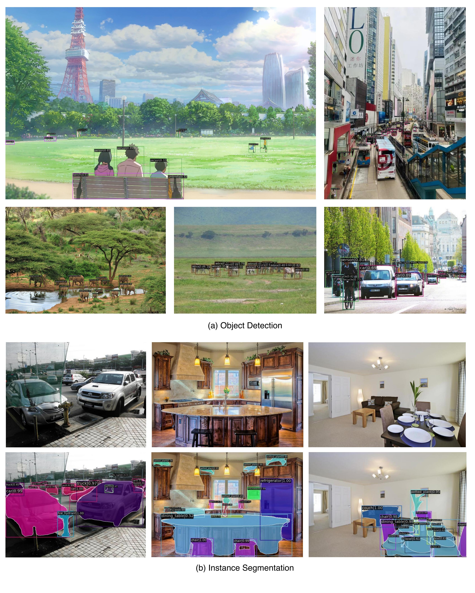

#  Parameter-Inverted Image Pyramid Networks (PIIP)


 [[📚 PIIP v1 Paper]](https://arxiv.org/abs/2406.04330) [[📚 PIIP v2 Paper]](https://arxiv.org/abs/2501.07783) [[🤗 Model]](https://huggingface.co/collections/OpenGVLab/piip-6804939a32e695f42cf3f227) [[📝 中文解读]](https://zhuanlan.zhihu.com/p/705734540) [[📑 Slides]](https://www.wzk.plus/slides/PIIP_slides.pdf) [[▶️ Video]](https://youtu.be/Kdh3CNp8bfg)


The official implementation of Parameter-Inverted Image Pyramid Networks.


**NeurIPS 2024 Spotlight & TPAMI 2025**

[Ranked Top 10 in NeurIPS 2024 (among 15671 submissions), Top 2 in Computer Vision Area](https://papercopilot.com/statistics/neurips-statistics/neurips-2024-statistics/)

## 📰 News

[2025/7/25] PIIP-LLaVA is accepted by [**TPAMI 2025**](https://ieeexplore.ieee.org/document/11098674)!

[2025/4/20] [Code](https://github.com/OpenGVLab/PIIP/tree/main/llava) and [models](https://huggingface.co/collections/OpenGVLab/piip-6804939a32e695f42cf3f227) of PIIP-LLaVA and ConvNeXt-based detection models are released!

[2025/1/15] We introduce **PIIP-LLaVA**, an MLLM that uses PIIP design to improve performance and save computational costs. We also extend PIIP to CNN-based structures and ViT-CNN hybrid structures. Code and models will be released soon. Check out our new **[paper](https://arxiv.org/abs/2501.07783)** for details.


## ⭐️ Highlights

**TL;DR:** We introduce the Parameter-Inverted Image Pyramid Networks (PIIP), employing a parameter-inverted paradigm that uses models with different parameter sizes to process different resolution levels of the image pyramid, thereby saving computation cost while improving the performance.

* Support tasks of **object detection, instance segmentation, semantic segmentation , image classification, and multimodal understanding.**
* Surpasses single-branch and other multi-resolution methods with **higher performance and lower computation costs.**
* Achieve **60.0 $\rm AP^b$)** on COCO object detection with InternViT-6B, and 73.0% accuracy on TextVQA and 74.5% on MMBench with only 2.8M training data.

<p align="center">
 
</p>


## 🖼 Qualitative Results

<p align="center">



</p>

## 📌 Abstract

Image pyramids are widely adopted in top-performing methods to obtain multi-scale features for precise visual perception and understanding. However, current image pyramids use the same large-scale model to process multiple resolutions of images, leading to significant computational cost. To address this challenge, we propose a novel network architecture, called Parameter-Inverted Image Pyramid Networks (PIIP). Specifically, PIIP uses pretrained models (ViTs or CNNs) as branches to process multi-scale images, where images of higher resolutions are processed by smaller network branches to balance computational cost and performance. To integrate information from different spatial scales, we further propose a novel cross-branch feature interaction mechanism. To validate PIIP, we apply it to various perception models and a representative multimodal large language model called LLaVA, and conduct extensive experiments on various tasks such as object detection, segmentation, image classification and multimodal understanding. PIIP achieves superior performance compared to single-branch and existing multi-resolution approaches with lower computational cost. When applied to InternViT-6B, a large-scale vision foundation model,  PIIP can improve its performance by 1%-2% on detection and segmentation with only 40\%-60\% of the original computation, finally achieving 60.0 box AP on MS COCO and 59.7 mIoU on ADE20K. For multimodal understanding, our PIIP-LLaVA achieves 73.0% accuracy on TextVQA and 74.5% on MMBench with only 2.8M training data.

## 🔍 Method


<p align="center">

</p>


## 🛠️ Usage

For instructions on installation, pretrained models, training and evaluation, please refer to the readme files under each subfolder:

- Object detection and instance segmentation: [mmdetection](mmdetection/README.md)
- Semantic segmentation: [mmsegmentation](mmsegmentation/README.md)
- Image classification: [classification](classification/README.md)
- Multimodal understanding: [llava](llava/README.md)

## 🚀 Released Models

### COCO Object Detection and Instance Segmentation

> [!Note]
> 1. We report the number of parameters and FLOPs of the backbone.
> 2. Results in the paper were obtained with an internal codebase, which may exhibit slightly different performance than this repo ($\leq\pm0.2$).
> 3. Experiments involving InternViT-6B do not use window attention, different from those in the paper.

**DeiT-based Models (Mask-RCNN, 1x Schedule)**

|   Backbone   |  Resolution     | Box mAP   |  Mask mAP  |  #Param  |    #FLOPs    |                                                                                                              Download                                                                                                              |
| :----------: | :----------------: | :---------: | :---------: | :------: | :-----------: | :---------------------------------------------------------------------------------------------------------------------------------------------------------------------------------------------------------------------------------: |
|    ViT-B    |  1024        |     43.7    |    39.7    |  90M  |     463G     |                                                              [log](https://huggingface.co/OpenGVLab/PIIP/raw/main/detection/mask_rcnn_deit_vit_b_fpn_1x_coco_bs16.log.json) \| [ckpt](https://huggingface.co/OpenGVLab/PIIP/resolve/main/detection/mask_rcnn_deit_vit_b_fpn_1x_coco_bs16.pth) \| [cfg](mmdetection/configs/piip/baseline/mask_rcnn_deit_vit_b_fpn_1x_coco_bs16.py)                                                              |
|   PIIP-TSB   |   1120/896/448    |  43.6 |    38.7    | 146M |     243G     |                                                         [log](https://huggingface.co/OpenGVLab/PIIP/raw/main/detection/mask_rcnn_deit_tsb_1120_896_448_fpn_1x_coco_bs16.log.json) \| [ckpt](https://huggingface.co/OpenGVLab/PIIP/resolve/main/detection/mask_rcnn_deit_tsb_1120_896_448_fpn_1x_coco_bs16.pth) \| [cfg](mmdetection/configs/piip/3branch/mask_rcnn_deit_tsb_1120_896_448_fpn_1x_coco_bs16.py)                                                         |
|   PIIP-TSB   |  1568/896/448    |   45.0    | 40.3 | 147M |     287G     |                                                         [log](https://huggingface.co/OpenGVLab/PIIP/raw/main/detection/mask_rcnn_deit_tsb_1568_896_448_fpn_1x_coco_bs16.log.json) \| [ckpt](https://huggingface.co/OpenGVLab/PIIP/resolve/main/detection/mask_rcnn_deit_tsb_1568_896_448_fpn_1x_coco_bs16.pth) \| [cfg](mmdetection/configs/piip/3branch/mask_rcnn_deit_tsb_1568_896_448_fpn_1x_coco_bs16.py)                                                         |
|   PIIP-TSB   |  1568/1120/672   |   46.5    |    41.3    | 149M | 453G |                                                         [log](https://huggingface.co/OpenGVLab/PIIP/raw/main/detection/mask_rcnn_deit_tsb_1568_1120_672_fpn_1x_coco_bs16.log.json) \| [ckpt](https://huggingface.co/OpenGVLab/PIIP/resolve/main/detection/mask_rcnn_deit_tsb_1568_1120_672_fpn_1x_coco_bs16.pth) \| [cfg](mmdetection/configs/piip/3branch/mask_rcnn_deit_tsb_1568_1120_672_fpn_1x_coco_bs16.py)                                                         |
|              |                     |            |            |          |              |                                                                                                                                                                                                                                    |
|    ViT-L    |      1024        |  46.7    |    42.5    | 308M |    1542G    |                                                              [log](https://huggingface.co/OpenGVLab/PIIP/raw/main/detection/mask_rcnn_deit_vit_l_fpn_1x_coco_bs16.log.json) \| [ckpt](https://huggingface.co/OpenGVLab/PIIP/resolve/main/detection/mask_rcnn_deit_vit_l_fpn_1x_coco_bs16.pth) \| [cfg](mmdetection/configs/piip/baseline/mask_rcnn_deit_vit_l_fpn_1x_coco_bs16.py)                                                              |
|   PIIP-SBL   |  1120/672/448    |   46.5 |    40.8    | 493M |     727G     |                                                         [log](https://huggingface.co/OpenGVLab/PIIP/raw/main/detection/mask_rcnn_deit_sbl_1120_672_448_fpn_1x_coco_bs16.log.json) \| [ckpt](https://huggingface.co/OpenGVLab/PIIP/resolve/main/detection/mask_rcnn_deit_sbl_1120_672_448_fpn_1x_coco_bs16.pth) \| [cfg](mmdetection/configs/piip/3branch/mask_rcnn_deit_sbl_1120_672_448_fpn_1x_coco_bs16.py)                                                         |
|   PIIP-SBL   |  1344/896/448    |      48.3    | 42.7 | 495M |   1002G   |                                                         [log](https://huggingface.co/OpenGVLab/PIIP/raw/main/detection/mask_rcnn_deit_sbl_1344_896_448_fpn_1x_coco_bs16.log.json) \| [ckpt](https://huggingface.co/OpenGVLab/PIIP/resolve/main/detection/mask_rcnn_deit_sbl_1344_896_448_fpn_1x_coco_bs16.pth) \| [cfg](mmdetection/configs/piip/3branch/mask_rcnn_deit_sbl_1344_896_448_fpn_1x_coco_bs16.py)                                                         |
|   PIIP-SBL   |  1568/896/672    |      49.3    |    43.7    | 497M | 1464G |                                                         [log](https://huggingface.co/OpenGVLab/PIIP/raw/main/detection/mask_rcnn_deit_sbl_1568_896_672_fpn_1x_coco_bs16.log.json) \| [ckpt](https://huggingface.co/OpenGVLab/PIIP/resolve/main/detection/mask_rcnn_deit_sbl_1568_896_672_fpn_1x_coco_bs16.pth) \| [cfg](mmdetection/configs/piip/3branch/mask_rcnn_deit_sbl_1568_896_672_fpn_1x_coco_bs16.py)                                                         |
|  PIIP-TSBL  |  1344/896/672/448  |   47.1 |    41.9    | 506M |     755G     |                                                       [log](https://huggingface.co/OpenGVLab/PIIP/raw/main/detection/mask_rcnn_deit_tsbl_1344_896_672_448_fpn_1x_coco_bs16.log.json) \| [ckpt](https://huggingface.co/OpenGVLab/PIIP/resolve/main/detection/mask_rcnn_deit_tsbl_1344_896_672_448_fpn_1x_coco_bs16.pth) \| [cfg](mmdetection/configs/piip/4branch/mask_rcnn_deit_tsbl_1344_896_672_448_fpn_1x_coco_bs16.py)                                                       |
|  PIIP-TSBL  |  1568/1120/672/448 |      48.2    | 42.9 |  507M |     861G     |                                                      [log](https://huggingface.co/OpenGVLab/PIIP/raw/main/detection/mask_rcnn_deit_tsbl_1568_1120_672_448_fpn_1x_coco_bs16.log.json) \| [ckpt](https://huggingface.co/OpenGVLab/PIIP/resolve/main/detection/mask_rcnn_deit_tsbl_1568_1120_672_448_fpn_1x_coco_bs16.pth) \| [cfg](mmdetection/configs/piip/4branch/mask_rcnn_deit_tsbl_1568_1120_672_448_fpn_1x_coco_bs16.py)                                                      |
|  PIIP-TSBL  |  1792/1568/1120/448 |      49.4    |    44.1    | 512M | 1535G |                                                      [log](https://huggingface.co/OpenGVLab/PIIP/raw/main/detection/mask_rcnn_deit_tsbl_1792_1568_1120_448_fpn_1x_coco_bs16.log.json) \| [ckpt](https://huggingface.co/OpenGVLab/PIIP/resolve/main/detection/mask_rcnn_deit_tsbl_1792_1568_1120_448_fpn_1x_coco_bs16.pth) \| [cfg](mmdetection/configs/piip/4branch/mask_rcnn_deit_tsbl_1792_1568_1120_448_fpn_1x_coco_bs16.py)                                                      |
|              |            |                    |      |            |            |          |              |                                                                                                                                                                                                                                    |
| InternViT-6B |      1024        |      53.8    |    48.1    | 5919M |   29323G   | [log](https://huggingface.co/OpenGVLab/PIIP/raw/main/detection/mask_rcnn_internvit_6b_fpn_1x_coco_bs16_ms.log.json) \| [ckpt](https://huggingface.co/OpenGVLab/PIIP/resolve/main/detection/mask_rcnn_internvit_6b_fpn_1x_coco_bs16_ms.pth) \| [cfg](mmdetection/configs/piip/baseline/mask_rcnn_internvit_6b_fpn_1x_coco_bs16_ms.py) |
|   PIIP-H6B |    1024/512      |      55.8    |    49.0    | 6872M |   11080G   |                                                       [log](https://huggingface.co/OpenGVLab/PIIP/raw/main/detection/mask_rcnn_internvit_h6b_1024_512_fpn_1x_coco_bs16_ms.log.json) \| [ckpt](https://huggingface.co/OpenGVLab/PIIP/resolve/main/detection/mask_rcnn_internvit_h6b_1024_512_fpn_1x_coco_bs16_ms.pth) \| [cfg](mmdetection/configs/piip/2branch/mask_rcnn_internvit_h6b_1024_512_fpn_1x_coco_bs16_ms.py)                                                       |


**More ViT Variants**

| Backbone |  Detector  |   Pretrain   |  Resolution  | Schd | Box mAP | Mask mAP |                                                          Download                                                          |
| :------: | :--------: | :-----------: | :-----------: | :--: | :-----: | :------: | :-------------------------------------------------------------------------------------------------------------------------: |
| PIIP-SBL | Mask R-CNN |    AugReg (384)    | 1568/1120/672 |  1x  |  48.3  |   42.6   |    [log](https://huggingface.co/OpenGVLab/PIIP/raw/main/detection/mask_rcnn_augreg_sbl_1568_1120_672_fpn_1x_coco_bs16.log.json) \| [ckpt](https://huggingface.co/OpenGVLab/PIIP/resolve/main/detection/mask_rcnn_augreg_sbl_1568_1120_672_fpn_1x_coco_bs16.pth) \| [cfg](mmdetection/configs/piip/3branch/mask_rcnn_augreg_sbl_1568_1120_672_fpn_1x_coco_bs16.py)    |
| PIIP-SBL | Mask R-CNN | DeiT III (S) + Uni-Perceiver (BL) | 1568/1120/672 |  1x  |  48.8  |   42.9   | [log](https://huggingface.co/OpenGVLab/PIIP/raw/main/detection/mask_rcnn_uniperceiver_sbl_1568_1120_672_fpn_1x_coco_bs16.log.json) \| [ckpt](https://huggingface.co/OpenGVLab/PIIP/resolve/main/detection/mask_rcnn_uniperceiver_sbl_1568_1120_672_fpn_1x_coco_bs16.pth) \| [cfg](mmdetection/configs/piip/3branch/mask_rcnn_uniperceiver_sbl_1568_1120_672_fpn_1x_coco_bs16.py) |
| PIIP-SBL | Mask R-CNN | DeiT III (S) + MAE (BL) | 1568/1120/672 |  1x  |  49.1  |   43.0   | [log](https://huggingface.co/OpenGVLab/PIIP/raw/main/detection/mask_rcnn_mae_sbl_1568_1120_672_fpn_1x_coco_bs16.log.json) \| [ckpt](https://huggingface.co/OpenGVLab/PIIP/resolve/main/detection/mask_rcnn_mae_sbl_1568_1120_672_fpn_1x_coco_bs16.pth) \| [cfg](mmdetection/configs/piip/3branch/mask_rcnn_mae_sbl_1568_1120_672_fpn_1x_coco_bs16.py) |
| PIIP-SBL | Mask R-CNN |  DeiT III   | 1568/1120/672 |  1x  |  50.0  |   44.4   |     [log](https://huggingface.co/OpenGVLab/PIIP/raw/main/detection/mask_rcnn_deit_sbl_1568_1120_672_fpn_1x_coco_bs16.log.json) \| [ckpt](https://huggingface.co/OpenGVLab/PIIP/resolve/main/detection/mask_rcnn_deit_sbl_1568_1120_672_fpn_1x_coco_bs16.pth) \| [cfg](mmdetection/configs/piip/3branch/mask_rcnn_deit_sbl_1568_1120_672_fpn_1x_coco_bs16.py)     |
| PIIP-SBL | Mask R-CNN |  DeiT III (S) + DINOv2 (BL)   | 1568/1120/672 |  1x  |  51.0  |   44.7   |    [log](https://huggingface.co/OpenGVLab/PIIP/raw/main/detection/mask_rcnn_dinov2_sbl_1568_1120_672_fpn_1x_coco_bs16.log.json) \| [ckpt](https://huggingface.co/OpenGVLab/PIIP/resolve/main/detection/mask_rcnn_dinov2_sbl_1568_1120_672_fpn_1x_coco_bs16.pth) \| [cfg](mmdetection/configs/piip/3branch/mask_rcnn_dinov2_sbl_1568_1120_672_fpn_1x_coco_bs16.py)    |
| PIIP-SBL | Mask R-CNN |   DeiT III (S) + BEiTv2 (BL)    | 1568/1120/672 |  1x  |  51.8  |   45.4   |     [log](https://huggingface.co/OpenGVLab/PIIP/raw/main/detection/mask_rcnn_beit_sbl_1568_1120_672_fpn_1x_coco_bs16.log.json) \| [ckpt](https://huggingface.co/OpenGVLab/PIIP/resolve/main/detection/mask_rcnn_beit_sbl_1568_1120_672_fpn_1x_coco_bs16.pth) \| [cfg](mmdetection/configs/piip/3branch/mask_rcnn_beit_sbl_1568_1120_672_fpn_1x_coco_bs16.py)     |
| PIIP-SBL | DINO |    DeiT III (384)    | 1792/1120/672 |  3x  |  57.8  |  -  |     [log](https://huggingface.co/OpenGVLab/PIIP/raw/main/detection/dino_4scale_deit_384_sbl_1792_1120_672_fpn_3x_coco_bs32_ms.log.json) \| [ckpt](https://huggingface.co/OpenGVLab/PIIP/resolve/main/detection/dino_4scale_deit_384_sbl_1792_1120_672_fpn_3x_coco_bs32_ms.pth) \| [cfg](mmdetection/configs/piip/3branch/dino_4scale_deit_384_sbl_1792_1120_672_fpn_3x_coco_bs32_ms.py)     |
| PIIP-H6B | DINO |    MAE (H) + InternVL (6B)    | 1024/768 |  1x  |  60.0  |  -  |     [log](https://huggingface.co/OpenGVLab/PIIP/raw/main/detection/dino_4scale_internvit_h6b_1024_768_fpn_1x_coco_bs32_ms.log.json) \| [ckpt](https://huggingface.co/OpenGVLab/PIIP/resolve/main/detection/dino_4scale_internvit_h6b_1024_768_fpn_1x_coco_bs32_ms.pth) \| [cfg](mmdetection/configs/piip/2branch/dino_4scale_internvit_h6b_1024_768_fpn_1x_coco_bs32_ms.py)     |

**ConvNeXt-based Models (Mask-RCNN, 1x Schedule)**

C: ConvNeXt. V: ViT (DeiT).

|   Backbone   |  Resolution     | Box mAP   |  Mask mAP  |  #FLOPs    |                                                                                                              Download                                                                                                              |
| :----------: | :----------------: | :---------: | :---------: | :-----------: | :---------------------------------------------------------------------------------------------------------------------------------------------------------------------------------------------------------------------------------: |
|   ConvNeXt-B   |   1024    |  42.4 |    38.7    |  321G     |  [cfg](mmdetection/configs/piip/baseline/mask_rcnn_convnext-base_1024_regular-fpn.py)    |
|   PIIP-CT-CS-CB   |   1024/672/448    |  46.4 |    41.7    |  326G     |                                                         [log](https://huggingface.co/OpenGVLab/PIIP/raw/main/detection/mask_rcnn_convnext-tsb_1024_672_448_regular-fpn.log) \| [ckpt](https://huggingface.co/OpenGVLab/PIIP/resolve/main/detection/mask_rcnn_convnext-tsb_1024_672_448_regular-fpn.pth) \| [cfg](mmdetection/configs/piip/convnext/mask_rcnn_convnext-tsb_1024_672_448_regular-fpn.py)                                                         |
|   PIIP-CT-VS-VB   |   1024/672/448    |  47.1 |    42.4    |  373G     |  [cfg](mmdetection/configs/piip/convnext/mask_rcnn_convnext-t_vit-s_vit-b_1024_672_448_regular-fpn.py)    |
|   PIIP-CT-CS-VB   |   1024/672/448    |  46.8 |    42.2    |  431G     |  [cfg](mmdetection/configs/piip/convnext/mask_rcnn_convnext-t_convnext-s_vit-b_1024_672_448_regular-fpn.py)    |
|   PIIP-CT-VS-CB   |   1024/672/448    |  46.7 |    42.0    |  297G     |  [cfg](mmdetection/configs/piip/convnext/mask_rcnn_convnext-t_vit-s_convnext-b_1024_672_448_regular-fpn.py)    |
|   PIIP-VT-CS-VB   |   1024/672/448    |  45.4 |    40.9    |  291G     |  [cfg](mmdetection/configs/piip/convnext/mask_rcnn_vit-t_convnext-s_vit-b_1024_672_448_regular-fpn.py)    |
|   PIIP-VT-CS-CB   |   1024/672/448    |  45.2 |    40.7    |  231G     |  [cfg](mmdetection/configs/piip/convnext/mask_rcnn_vit-t_convnext-s_convnext-b_1024_672_448_regular-fpn.py)    |
|   PIIP-VT-VS-CB   |   1024/672/448    |  44.8 |    40.3    |  193G     |  [cfg](mmdetection/configs/piip/convnext/mask_rcnn_vit-t_vit-s_convnext-b_1024_672_448_regular-fpn.py)    |


### ADE20K Semantic Segmentation

|   Backbone   |  Detector  |     Resolution     | Schd | mIoU |  #Param  |    #FLOPs    |                                                                                                              Download                                                                                                              |
| :----------: | :--------: | :----------------: | :--: | :---------: | :------: | :-----------: | :---------------------------------------------------------------------------------------------------------------------------------------------------------------------------------------------------------------------------------: |
| InternViT-6B | UperNet | 512 | 80k | 58.42  | 5910M | 6364G | [log](https://huggingface.co/OpenGVLab/PIIP/raw/main/segmentation/upernet_internvit_6b_512_80k_ade20k_bs16_lr4e-5.log) \| [ckpt](https://huggingface.co/OpenGVLab/PIIP/resolve/main/segmentation/upernet_internvit_6b_512_80k_ade20k_bs16_lr4e-5.pth) \| [cfg](mmsegmentation/configs/piip/baseline/upernet_internvit_6b_512_80k_ade20k_bs16_lr4e-5.py) |
| PIIP-H6B | UperNet | 512/192 | 80k | 57.81  | 6745M | 1663G | [log](https://huggingface.co/OpenGVLab/PIIP/raw/main/segmentation/upernet_internvit_h6b_192_512_80k_ade20k_bs16_lr4e-5.log) \| [ckpt](https://huggingface.co/OpenGVLab/PIIP/resolve/main/segmentation/upernet_internvit_h6b_192_512_80k_ade20k_bs16_lr4e-5.pth) \| [cfg](mmsegmentation/configs/piip/2branch/upernet_internvit_h6b_192_512_80k_ade20k_bs16_lr4e-5.py) |
| PIIP-H6B | UperNet | 512/256 | 80k | 58.35  | 6745M | 2354G | [log](https://huggingface.co/OpenGVLab/PIIP/raw/main/segmentation/upernet_internvit_h6b_256_512_80k_ade20k_bs16_lr4e-5.log) \| [ckpt](https://huggingface.co/OpenGVLab/PIIP/resolve/main/segmentation/upernet_internvit_h6b_256_512_80k_ade20k_bs16_lr4e-5.pth) \| [cfg](mmsegmentation/configs/piip/2branch/upernet_internvit_h6b_256_512_80k_ade20k_bs16_lr4e-5.py) |
| PIIP-H6B | UperNet | 512/384 | 80k | 59.32  | 6746M | 4374G | [log](https://huggingface.co/OpenGVLab/PIIP/raw/main/segmentation/upernet_internvit_h6b_384_512_80k_ade20k_bs16_lr4e-5.log) \| [ckpt](https://huggingface.co/OpenGVLab/PIIP/resolve/main/segmentation/upernet_internvit_h6b_384_512_80k_ade20k_bs16_lr4e-5.pth) \| [cfg](mmsegmentation/configs/piip/2branch/upernet_internvit_h6b_384_512_80k_ade20k_bs16_lr4e-5.py) |
| PIIP-H6B | UperNet | 512/512 | 80k | 59.85  | 6747M | 7308G | [log](https://huggingface.co/OpenGVLab/PIIP/raw/main/segmentation/upernet_internvit_h6b_512_512_80k_ade20k_bs16_lr4e-5.log) \| [ckpt](https://huggingface.co/OpenGVLab/PIIP/resolve/main/segmentation/upernet_internvit_h6b_512_512_80k_ade20k_bs16_lr4e-5.pth) \| [cfg](mmsegmentation/configs/piip/2branch/upernet_internvit_h6b_512_512_80k_ade20k_bs16_lr4e-5.py) |

###  ImageNet-1K Image Classification


| Model    | Resolution  | #Param | #FLOPs | Top-1 Acc | Config                                                                            | Download                                                                                                                                                                                                                                                  |
| -------- | ----------- | ------ | ------ | --------- | --------------------------------------------------------------------------------- | --------------------------------------------------------------------------------------------------------------------------------------------------------------------------------------------------------------------------------------------------------- |
| PIIP-TSB | 368/192/128 | 144M   | 17.4G   | 82.1      | [config](classification/configs/piip_3branch_tsb_368-192-128_cls_token_deit1.py)  | [log](https://huggingface.co/OpenGVLab/PIIP/resolve/main/classification/piip_3branch_tsb_368-192-128_cls_token_deit1.txt) \| [ckpt](https://huggingface.co/OpenGVLab/PIIP/resolve/main/classification/piip_3branch_tsb_368-192-128_cls_token_deit1.pth)   |
| PIIP-SBL | 320/160/96  | 489M   | 39.0G   | 85.2      | [config](classification/configs/piip_3branch_sbl_320-160-96_cls_token_augreg.py)  | [log](https://huggingface.co/OpenGVLab/PIIP/resolve/main/classification/piip_3branch_sbl_320-160-96_cls_token_augreg.txt) \| [ckpt](https://huggingface.co/OpenGVLab/PIIP/resolve/main/classification/piip_3branch_sbl_320-160-96_cls_token_augreg.pth)   |
| PIIP-SBL | 384/192/128 | 489M   | 61.2G   | 85.9      | [config](classification/configs/piip_3branch_sbl_384-192-128_cls_token_augreg.py) | [log](https://huggingface.co/OpenGVLab/PIIP/resolve/main/classification/piip_3branch_sbl_384-192-128_cls_token_augreg.txt) \| [ckpt](https://huggingface.co/OpenGVLab/PIIP/resolve/main/classification/piip_3branch_sbl_384-192-128_cls_token_augreg.pth) |

### Multimodal Understanding


| Model                                         | Vision Encoder     | Resolution | #FLOPs | LLM        | Data | Download                                                     | MMB<sup>EN</sup> | MMVet | TextVQA | SQA<sup>I</sup> | GQA  | VQAv2 | SEED<sup>I</sup> | POPE | Avg  |
| --------------------------------------------- | ------------------ | ---------- | ------ | ---------- | ---- | ------------------------------------------------------------ | ---------------- | ----- | ------- | --------------- | ---- | ----- | ---------------- | ---- | ---- |
| LLaVA-1.5_7B                                  | CLIP-L             | 336        | 191G   | Vicuna-7B  | 1.2M | [ckpt](https://huggingface.co/liuhaotian/llava-v1.5-7b)      | 64.3             | 31.1  | 58.2    | 66.8            | 62.0 | 78.5  | 66.1             | 85.9 | 64.1 |
| PIIP-LLaVA_CLIP-BL_512-256_7B                 | CLIP-B, CLIP-L     | 512/256    | 193G   | Vicuna-7B  | 1.2M | [ckpt](https://huggingface.co/OpenGVLab/PIIP-LLaVA_CLIP-BL_512-256_7B) \| [cfg](llava/configs/piip-llava_clip-bl_512-256_7B.py) | 63.8             | 32.0  | 57.9    | 68.8            | 62.8 | 79.1  | 67.3             | 86.5 | 64.8 |
| PIIP-LLaVA_ConvNeXt-B_CLIP-L_640-224_7B       | ConvNeXt-B, CLIP-L | 640/224    | 191G   | Vicuna-7B  | 1.2M | [ckpt](https://huggingface.co/OpenGVLab/PIIP-LLaVA_ConvNeXt-B_CLIP-L_640-224_7B) \| [cfg](llava/configs/piip-llava_convnext-b_clip-l_640-224_7B.py) | 64.5             | 31.9  | 59.0    | 68.3            | 62.1 | 79.9  | 67.5             | 86.5 | 65.0 |
| PIIP-LLaVA_CLIP-BL_512-448_7B                 | CLIP-B, CLIP-L     | 512/448    | 422G   | Vicuna-7B  | 1.2M | [ckpt](https://huggingface.co/OpenGVLab/PIIP-LLaVA_CLIP-BL_512-448_7B) \| [cfg](llava/configs/piip-llava_clip-bl_512-448_7B.py) | 66.2             | 30.5  | 59.5    | 68.0            | 63.7 | 80.3  | 69.0             | 87.3 | 65.6 |
| PIIP-LLaVA_ConvNeXt-B_CLIP-L_1024-336_7B      | ConvNeXt-B, CLIP-L | 1024/336   | 598G   | Vicuna-7B  | 1.2M | [ckpt](https://huggingface.co/OpenGVLab/PIIP-LLaVA_ConvNeXt-B_CLIP-L_1024-336_7B) \| [cfg](llava/configs/piip-llava_convnext-b_clip-l_1024-336_7B.py) | 67.5             | 31.5  | 63.1    | 68.1            | 62.7 | 81.1  | 69.0             | 87.9 | 66.4 |
| PIIP-LLaVA_ConvNeXt-L_CLIP-L_1024-336_7B      | ConvNeXt-L, CLIP-L | 1024/336   | 1037G  | Vicuna-7B  | 1.2M | [ckpt](https://huggingface.co/OpenGVLab/PIIP-LLaVA_ConvNeXt-L_CLIP-L_1024-336_7B) \| [cfg](llava/configs/piip-llava_convnext-l_clip-l_1024-336_7B.py) | 67.0             | 31.4  | 67.1    | 68.3            | 63.9 | 81.5  | 69.4             | 88.2 | 67.1 |
| PIIP-LLaVA-Plus_ConvNeXt-L_CLIP-L_1024-336_7B | ConvNeXt-L, CLIP-L | 1024/336   | 1037G  | Vicuna-7B  | 2.7M | [ckpt](https://huggingface.co/OpenGVLab/PIIP-LLaVA-Plus_ConvNeXt-L_CLIP-L_1024-336_7B) \| [cfg](llava/configs/piip-llava-plus_convnext-l_clip-l_1024-336_7B.py) | 74.5             | 44.7  | 73.0    | 95.0            | 62.9 | 82.3  | 72.1             | 87.5 | 74.0 |
|                                               |                    |            |        |            |      |                                                              |                  |       |         |                 |      |       |                  |      |      |
| LLaVA-1.5_13B                                 | CLIP-L             | 336        | 191G   | Vicuna-13B | 1.2M | [ckpt](https://huggingface.co/liuhaotian/llava-v1.5-13b)     | 67.7             | 36.1  | 61.3    | 71.6            | 63.3 | 80.0  | 68.2             | 85.9 | 66.8 |
| PIIP-LLaVA_CLIP-BL_512-448_13B                | CLIP-B, CLIP-L     | 512/448    | 422G   | Vicuna-13B | 1.2M | [ckpt](https://huggingface.co/OpenGVLab/PIIP-LLaVA_CLIP-BL_512-448_13B) \| [cfg](llava/configs/piip-llava_clip-bl_512-448_13B.py) | 67.6             | 36.1  | 61.6    | 71.0            | 64.5 | 81.2  | 69.5             | 87.2 | 67.3 |
| PIIP-LLaVA_ConvNeXt-B_CLIP-L_1024-336_13B     | ConvNeXt-B, CLIP-L | 1024/336   | 598G   | Vicuna-13B | 1.2M | [ckpt](https://huggingface.co/OpenGVLab/PIIP-LLaVA_ConvNeXt-B_CLIP-L_1024-336_13B) \| [cfg](llava/configs/piip-llava_convnext-b_clip-l_1024-336_13B.py) | 68.5             | 37.7  | 64.2    | 71.1            | 64.2 | 81.8  | 69.3             | 87.9 | 68.0 |
| PIIP-LLaVA_ConvNeXt-L_CLIP-L_1024-336_13B     | ConvNeXt-L, CLIP-L | 1024/336   | 1037G  | Vicuna-13B | 1.2M | [ckpt](https://huggingface.co/OpenGVLab/PIIP-LLaVA_ConvNeXt-L_CLIP-L_1024-336_13B) \| [cfg](llava/configs/piip-llava_convnext-l_clip-l_1024-336_13B.py) | 66.5             | 36.8  | 69.2    | 69.8            | 65.2 | 82.5  | 70.5             | 87.6 | 68.5 |


## 🖊️ Citation

If you find this work helpful for your research, please consider giving this repo a star ⭐ and citing our paper:

```bibtex
@inproceedings{piip,
  title={Parameter-Inverted Image Pyramid Networks},
  author={Zhu, Xizhou and Yang, Xue and Wang, Zhaokai and Li, Hao and Dou, Wenhan and Ge, Junqi and Lu, Lewei and Qiao, Yu and Dai, Jifeng},
  booktitle={NeurIPS},
  year={2024}
}

@article{piip_v2,
  title={Parameter-Inverted Image Pyramid Networks for Visual Perception and Multimodal Understanding},
  author={Wang, Zhaokai and Zhu, Xizhou and Yang, Xue and Luo, Gen and Li, Hao and Tian, Changyao and Dou, Wenhan and Ge, Junqi and Lu, Lewei and Qiao, Yu and Dai, Jifeng},
  journal={IEEE transactions on pattern analysis and machine intelligence},
  year={2025},
  publisher={IEEE}
}
```

## 📃 License

This project is released under the [MIT license](LICENSE). Parts of this project contain code and models from other sources, which are subject to their respective licenses.

## 🙏 Acknowledgements

Our code is built with reference to the code of the following projects: [LLaVA-1.5](https://github.com/haotian-liu/LLaVA), [InternVL-MMDetSeg](https://github.com/OpenGVLab/InternVL-MMDetSeg), [ViT-Adapter](https://github.com/czczup/ViT-Adapter),  [DeiT](https://github.com/facebookresearch/deit), [MMDetection](https://github.com/open-mmlab/mmdetection), [MMSegmentation](https://github.com/open-mmlab/mmsegmentation), and [timm](https://github.com/huggingface/pytorch-image-models). Thanks for their awesome work!
